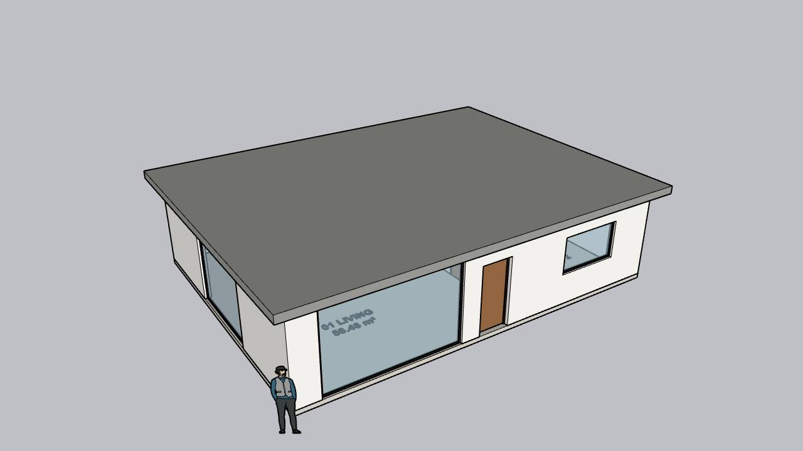
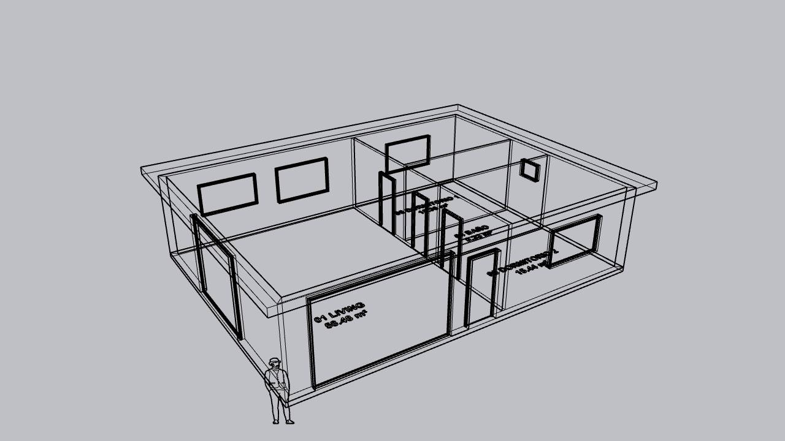

<div align="center">

# Plomada

**Hand Claude an AutoCAD plan and get the exact 3D house in SketchUp: manifold walls, real openings, one Ctrl+Z.**

[](https://github.com/Mats2208/plomada-mcp/releases)
[](https://github.com/Mats2208/plomada-mcp/actions/workflows/ci.yml)
[](https://www.sketchup.com)
[](https://www.python.org)
[](https://modelcontextprotocol.io)
[](LICENSE)

<br/>

<table>
<tr>
<td width="50%"></td>
<td width="50%"></td>
</tr>
</table>
<sub>Both images came back from <code>capture_view</code> in the e2e run, 116 ms and 100 ms after the call. Look at the wireframe: the three
doors in the partition, the two partitions butting into it and into the exterior wall, and the room labels on the floor
(<strong>01 LIVING 58.48 m²</strong>) all came from the DXF records, not from a prompt.</sub>

<br/><br/>

<table>
<tr>
<td align="center"><strong>0.81 s</strong><br/><sub>DXF to finished house (p50)</sub></td>
<td align="center"><strong>24</strong><br/><sub>MCP tools</sub></td>
<td align="center"><strong>31 ms</strong><br/><sub>model_info p50</sub></td>
<td align="center"><strong>46 ms</strong><br/><sub>longest pump tick</sub></td>
<td align="center"><strong>115</strong><br/><sub>tests, no SketchUp needed</sub></td>
</tr>
</table>

<sub>[The problem](#the-problem) · [What it does](#what-it-does) · [Numbers](#every-number-here-was-measured) · [Install](#install) · [Use](#use) · [How it works](#how-it-works) · [Comparison](#how-it-compares) · [Limits](#what-it-does-not-do)</sub>

</div>

---

## The problem

AutoCAD MCP Pro draws a plan with real architectural records: walls with an axis and a thickness, doors and windows hosted
at an offset along them, rooms with their area. Getting that into SketchUp as a model you can render usually means
importing the linework and rebuilding every wall by hand.

The SketchUp MCP servers that exist today make that worse in three ways:

- **They give the model primitives**, not architecture. Boxes, faces and push/pull leave the LLM to invent wall joints,
  and it gets mitres and T junctions wrong.
- **They cut openings with booleans.** `Group#subtract` is a Pro-only Solid Tools call that returns `nil` on any wall
  that is not already a solid.
- **They freeze or starve SketchUp.** Servers built on Ruby threads only run while SketchUp's main thread yields, and a
  long operation inside one call blocks the UI until it ends.

## What it does

`build_from_autocad("casa_minimalista.dxf")` reads the ACADMCP_ARCH records in the bridge, solves every wall junction in
pure Ruby, and builds the house inside a running SketchUp, one small step per UI tick:

| | Feature | Details |
|---|---|---|
| **Walls** | One closed manifold per storey | Mitred L corners, T junctions trimmed to the near face, X crossings cut at the faces. No booleans, no `find_faces`. |
| **Openings** | Real holes with reveals | Two jambs, a soffit, and a sill when the sill is above 0, in every opening. |
| **Carpentry** | Window and door components | 50 × 50 mm frame ring and a 6 mm pane at mid-thickness; 40 mm door leaf hinged per the plan's hand and swing. |
| **Rest of the storey** | Slab · flat or gable roof · room labels | Slab under the outer face, roof with a 400 mm overhang, 3D labels with name, number and m². |
| **Undo** | One Ctrl+Z per tool call | All steps of a job chain into one operation. A failed, expired or cancelled job reverts itself. |
| **Edits** | Move, resize, add | `move_opening`, `set_wall_height`, `add_wall`, `add_opening` re-solve from the plan stored in the model, never from the DXF. |
| **Views** | Captures, scenes, exports | JPEG captures under 350 KB, two-point eye-height scenes, scene images, skp / fbx / obj export. |

Everything is in millimetres and named for the studio pipeline: groups `N00_muros`, `N00_losa`, `N00_techo`; tags
`Muros`, `Carpinterias`, `Losas`, `Ambientes`; materials `MAT_revoque_blanco`, `MAT_vidrio`, `MAT_madera` and the rest.

## Every number here was measured

On the reference house (4 walls, 11 openings, 4 rooms), through the real stdio MCP server, against SketchUp 2025 Pro
25.0.571 on an AMD Ryzen 9 9900X with an RTX 3060. Source: [`bench/results-2026-10-08.json`](bench/results-2026-10-08.json)
and [`bench/e2e-2026-10-08.json`](bench/e2e-2026-10-08.json).

| Target | Budget | Measured |
|---|---|---|
| `build_from_autocad` on the fixture, end to end | < 3.0 s | **0.81 s** p50, 0.85 s max of 5 |
| `model_info`, 200 calls | p50 < 60 ms, p95 < 150 ms | **31.3 ms** p50, 34.6 ms p95 |
| `capture_view` 1280 × 720 | < 400 ms | **100 ms** p50, 120 ms max of 10 |
| Longest pump tick while building and answering | < 100 ms | **46.4 ms** (preparing the build and its first step) |
| Wall faces built / internal faces left / manifold | | 78 / 0 / true |

`python scripts/bench.py --certify` re-runs these and exits 1 if any target is missed.

**What does not fit in 100 ms, said plainly.** A viewport capture is one native `view.write_image` call that cannot be
split; in the committed run its tick took 88.9 ms, and it can go past 100 ms, which is why the bench reports it apart
from the pump. An FBX export is also one native call: 1371 ms the first time in the e2e run. `execute_ruby` runs your
code in one tick.

## Install

You need Windows 11, SketchUp 2025 Pro, [uv](https://docs.astral.sh/uv/) 0.11.25 and the
[`claude`](https://docs.claude.com/en/docs/claude-code) CLI. SketchUp 2024 and 2026 are targeted through feature
detection but were not run here.

```powershell
git clone https://github.com/Mats2208/plomada-mcp C:\mcp\plomada-mcp
cd C:\mcp\plomada-mcp
powershell -ExecutionPolicy Bypass -File scripts\install.ps1
```

The script copies `plomada.rb` and `plomada\` into the SketchUp Plugins folder and runs `uv sync`. It sets
`mcpServers.sketchup` in the Claude Desktop config, after a timestamped backup and leaving every other entry untouched.
It registers `plomada-mcp` for Claude Code with `claude mcp add -s user sketchup`. It also offers, y/n, to move the old
Tarkiin plugin out of the Plugins folder. Restart SketchUp, reconnect the MCP, and call `status`.

To install by hand instead, add [`plomada-0.1.1.rbz`](https://github.com/Mats2208/plomada-mcp/releases) through
**Extensions > Extension Manager > Install Extension**, then register `.venv\Scripts\plomada-mcp.exe` as a stdio server.

## Use

> _"Build the house in `PROYECTOS/3D/casa-minimalista/01_cad/casa_minimalista.dxf` and show it to me."_

```text
status              -> protocol 1, pro true, entities_build true, pbr true, fbx_export true
build_from_autocad  -> walls 4, openings 11 (4 doors, 7 windows), rooms 4, manifold true, 24 steps, 0.81 s
capture_view        -> image/jpeg 1280x720, 37 710 bytes
move_opening W2 8000 -> manifold true; the hole and the window moved together, still one undo step
```

| Kind | Tools |
|---|---|
| **Read-only** | `status` · `model_info` · `list_entities` · `list_tags` · `list_materials` · `get_plan` · `capture_view` · `job_status` |
| **Build** | `build_from_autocad` · `build_plan` |
| **Edit** | `add_wall` · `add_opening` · `move_opening` · `set_wall_height` · `add_slab` · `add_roof` · `set_material` |
| **Scenes and exports** | `create_scene` · `export_scene_images` · `export_model` |
| **Housekeeping** | `reset_plomada` · `undo` · `job_cancel` · `execute_ruby` (off by default) |

Every length is millimetres. Every tool carries honest `readOnlyHint`, `destructiveHint` and `idempotentHint`
annotations, and refusals name the field: `walls[2].thickness must be greater than 0, got -200`.

## How it works

```text
Claude ──stdio──> plomada-mcp (Python)  ──127.0.0.1:7883, length-prefixed JSON-RPC, token──>  Plomada (Ruby, inside SketchUp)
                  parses the DXF (ezdxf)                                                     one UI.start_timer pump:
                  validates (pydantic)                                                        accept · read · enqueue ·
                  retries reads, never mutations                                              reads (15 ms) · 1 job step (40 ms) · write
```

- **One pump, no threads.** Everything runs in one re-entrancy-guarded timer on SketchUp's main thread: 30 ms ticks
  while busy, 100 ms when idle. A second client's `status` keeps answering during a build.
- **Geometry first, model second.** `Plomada::Geometry` has no SketchUp dependency. Each wall segment is cut into a grid of
  cells at jambs, junction faces and every sill and head of the storey. Cells inside an opening are skipped, shared cell
  sides cancel, and coplanar pieces merge into faces with holes. The result is a closed manifold by construction, and it is
  unit-tested before SketchUp sees it.
- **One undo per call.** The first step opens the operation and stamps the job on the model. Every later step chains onto
  it transparently. SketchUp drops operations that change nothing, so without the stamp a no-op first step would let the
  chain merge into the previous undo entry.
- **Bounded failure.** Every request carries a deadline. When a job expires, is cancelled or raises, it aborts and is
  undone. When SketchUp is blocked by a modal dialog, `status` answers within 5 s with "SketchUp is not responding: a modal
  dialog may be open in SketchUp, close it and retry" instead of hanging.

The token, loopback and eval model are described in [SECURITY.md](SECURITY.md).

## How it compares

Each cell was checked against the design study of 25 SketchUp MCPs that preceded this build and against each repo's
source.

| | Transport | Auth | Ruby eval by default | Architecture tools | Needs booleans | Tests |
|---|---|---|---|---|---|---|
| **Plomada** | Length-prefixed JSON-RPC on loopback TCP, UI-timer pump, stdio bridge | 64-hex token, constant-time compare, required | Off | Plan in: walls, openings, carpentry, slab, roof, rooms, scenes | No | 75 minitest + 48 pytest, live e2e, bench |
| [Tarkiin/SketchUp-MCP](https://github.com/Tarkiin/SketchUp-MCP) | HTTP on 127.0.0.1:8080, served by Ruby threads, `Access-Control-Allow-Origin: *` | None | On | Primitives and `create_roof_truss` | No | None |
| [zinin/sketchup-mcp2](https://github.com/zinin/sketchup-mcp2) | Length-prefixed JSON-RPC on TCP, UI-timer pump, stdio bridge | None (loopback default) | On (`eval_enabled: true`) | Woodworking joints | Yes (`Group#subtract`) | Ruby minitest + Python |
| [PMajesty/sk_ruby_mcp](https://github.com/PMajesty/sk_ruby_mcp) | Streamable HTTP inside SketchUp, Host/Origin guard, no bridge | Optional, empty by default | On | Massing boxes, façade openings as glued components | No | Ruby test suite + soak scripts |
| [iamahsanmehmood/saie](https://github.com/iamahsanmehmood/saie) | WebSocket JSON-RPC on 127.0.0.1:9876 | Optional, empty by default | On | Walls, openings, slabs, roofs, DXF parsing | Yes (openings are `subtract`) | pytest unit and integration |

## What it does not do

- **One storey, no stairs.** Stair records in the DXF are skipped with a warning.
- **Straight walls only.** Curved axes are refused, as are three or more walls ending at one point and junctions sharper
  than 5°.
- **Gable roofs need a rectangular footprint.** Anything else gets `gable needs a rectangular footprint; use flat`.
- **`export_model` skp needs a model saved once.** SketchUp refuses to copy an untitled model, and `Model#save` can
  raise a modal prompt that would freeze the pump.
- **`execute_ruby` is a guard against mistakes, not a sandbox.** It is off until you tick the box in
  **Extensions > Plomada > Settings**.

## Development

```powershell
uv run pytest                     # bridge: DXF, models, errors, socket, MCP tools (48 tests)
ruby -Itest test/run_all.rb       # extension: geometry, plan, pump (75 tests, Ruby 3.2, no SketchUp)
uv run ruff check . ; uv run ruff format --check .
uv run python scripts/e2e_house.py        # live: needs SketchUp with the extension
uv run python scripts/bench.py --certify  # live: writes bench/results-<date>.json
uv run python scripts/build_rbz.py        # dist/plomada-<version>.rbz
uv run python scripts/check_compat.py some.skp   # is this file newer than the installed SketchUp?
```

CI runs ruff, pytest and the Ruby suite on Windows and Ubuntu. Tuning constants live in
[`extension/plomada/config.rb`](extension/plomada/config.rb) and [`src/plomada_bridge/config.py`](src/plomada_bridge/config.py),
one place per side. Release notes are in [CHANGELOG.md](CHANGELOG.md).

## Repo layout

```text
extension/plomada.rb        loader (registers the extension)
extension/plomada/          the extension: pump, protocol, geometry/ (pure Ruby), su/ (SketchUp side)
src/plomada_bridge/         the stdio MCP server: tools, socket client, DXF reader, pydantic models
test/                       minitest suite with FakeSocket, FakeModel, FakeEntities, FakeView
tests/                      pytest suite and fixtures (the reference DXF and its decoded records)
scripts/                    install.ps1, e2e_house.py, bench.py, build_rbz.py, check_compat.py
bench/                      measured results
docs/img/                   images from the e2e run
```

## License

[MIT](LICENSE)
